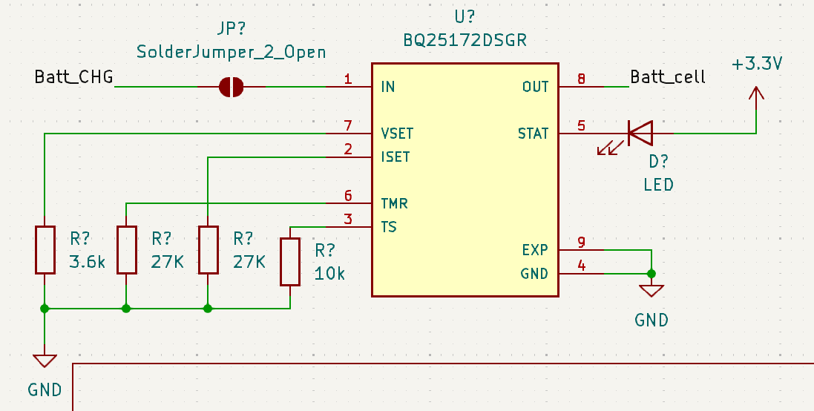
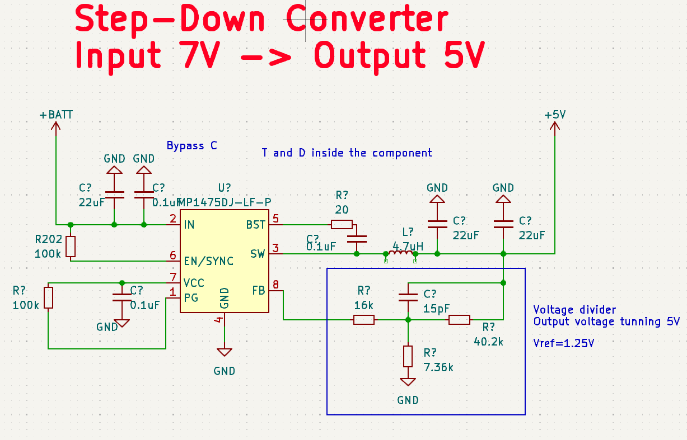
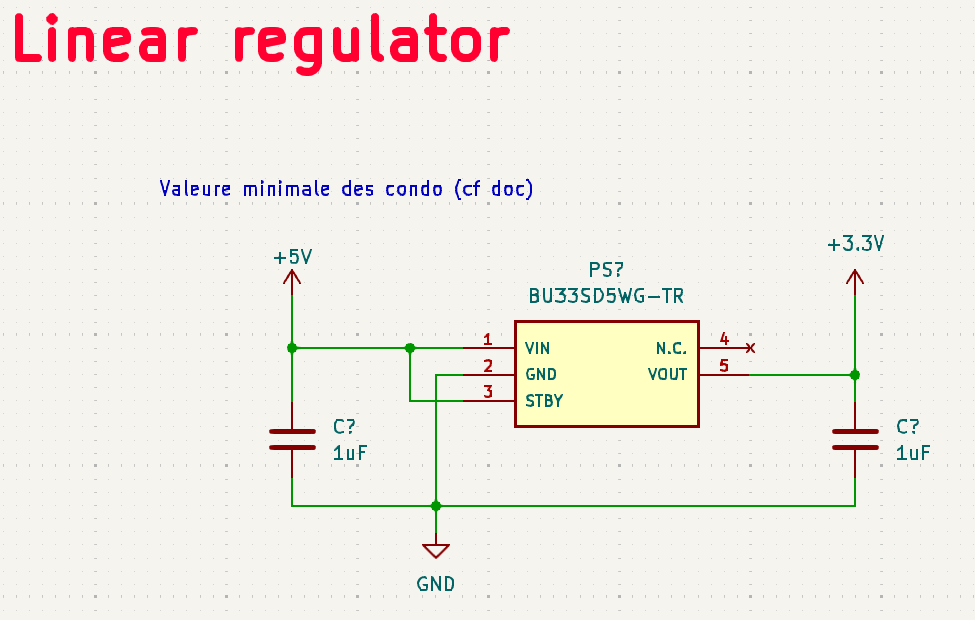

# Partie éléctronique 

## Sommaire
- [Présentation](#présentation)
- [Alimentation](#alimentation)
- [Driver Moteurs](#drivers-moteurs)
- [STM32](#stm32)
- [Peripheriques](#périphériques)
- [Peripherique Annexe](#périphériques-annexes)
- [Musique](#musique)

---

## Présentation
Bienvenue dans la partie éléctronique du projet, dans ce dossier sont présent tous les fichiers de conception du PCB KiCad ainsi que tous les fichiers de fabrications Gerber.  
Il est détaillé chaque composante du Schématique/PCb dans ce Read.me  

---

## Alimentation
Pour notre robot nous utilisons plusieurs système pour gérer le circuit d'alimentation. On a entre autre un BMS ( Batterie système management ), ainsi qu'un pseudo Power Path Management. La batterie utilisée est la suivante : here  

Des connecteurs Pac-Man sont utilisés au niveau de la recharge de batterie afin de pouvoir déconnecter facilement le circuit de charge si il est foireux. De plus un interrupteur est ajouté pour allumer/Eteindre le robot ainsi qu'un fusible pour protéger des surcourants sur la batterie.  

**Recharge de batterie**

[[Capture]]

Pour la recharge de la batterie nous prévoyons deux connecteurs : Type-C et Bornier afin de pouvoir recharger la batterie par alimentation stabilisée de labo ainsi que par cable USB-C (Plus difficile à mettre en oeuvre).  

>[!Note]
>Cette entrée d'energie est gérée par le **BMS [BQ25172DSGR](../datasheet/BQ25172.pdf)de TI**. Celui-ci est cablé tel quel :  
>* IN : Entrée de tension de charge de batterie. Max 0.8 A (Cf : Doc)  
>* VSET : Programme le nombre de cellule --> 6 cellules + Charge intermittente  
>* ISET : Programme le courant de charge --> 0.8A   
>* TMR : Programme le Timer de sureté --> 6Hr  
>* TS : Programme la température de sureté de charge --> Donnée constructeur    
>* OUT : Sortie de tension de charge de la batterie  
>* STAT : Sortie d'indication de l'état de charge à drain ouvert  
>* EXP : Ground (Pad thermique)  
>* GND : Ground  

[[Capture]]

On a un transistor à canal P pour bloquer la charge du circuit par batterie lorsqu'une tension vient du bornier ou de l'USB-C. De plus on ajoute des condensateur (C...) pour eviter les retours de courant dû a des freinage des roues dans la résistance et donc dans l'alimentation derrière.  

On utilise un premier convertisseur Buck pour abaisser la tension à 5V. Celui-ci est à découpage donc plus cher mais possède un meilleur rendement et un plus faible échauffement. Cela est parfait puisqu'il alimente le lidar ainsi que tous les circuits 3.3v derrière et donc peut avoir des appels de courant assez élevé (Comme démarrage de lidar).  

**Convertisseur Buck (MP1475DJ-LF-P)**  
    -IN : Tension d'entrée  
    -BST : Bootstrap  
    -SWT : Sortie de commutation  
    -PG : Sortie de puissance  
    -VCC : LDO interne de 5v  
    -EN/SYNC : Pour les clocks externes  
    -FB : Feedback  
    -GND : Ground  

Actuellement les données sont celle ce la doc. La seule chose réglée est le pont diviseur avec une Vref = 1.25V pour avoir une sortie de 5V en sortie.  

Simple convertisseur linéaire qui abaisse de 5V vers 3.3V pour alimenter certains capteurs ou encore la STM32 qui n'accepte pas du 5V. L'utilisation d'un buck serai plus utile si on recherche la performance cependant un LDO est suffisant car moins couteux, plus simple à mettre en place. L'abaissement de tension est faible sur de faible courants par conséquent la dissipation thermique sera faible ce qui justifie un LDO plutôt qu'un buck.  

**Convertisseur LDO [(BU33SD5WG-TR)](../datasheet/**  
    -VIN : Tension d'entrée  
    -GND : Ground  
    -STBY : StandBy --> Ici sur High il marche dés qu'il est alimenté.   
    -N. C. : No Connected pin  
    -Vout : Tension de sortie  

---

## Drivers moteurs
Afin de pouvoir mouvoir le robot sur la table de jeu, nous utilisons des moteurs type MCC (DfRobot FIT0520). Ces moteurs possèdent des codeurs déjà sur l'arbre moteur ce qui a l'avantage de ne négliger aucun décalage entre une roue de codeur et la roue de l'arbre moteur. Cependant si jamais la roue patine ou glisse le codeur ne prendra pas en compte ce dérapage ce qui entrainera des erreurs. Il faut donc impérativement que la mécanique permette au robot de rester particulièrement stabilisé sur le sol.  

[[Capture]]

Branché sur la carte les deux moteurs auront de beaux JST-XH de 6 Pins chacun tels que :  
    -Motor - : Phase - du moteur  
    -Motor + : Phase + du moteur  
    -GND : Ground   
    -5V : Alimentation des codeurs en 5V   
    -Codeur PH1 : Pin allant avec PH2 avec la trame du codeur pour déterminer ensuite la vitesse du robot.   
    -Codeur PH2 : Pin allant avec PH1 avec la trame du codeur pour déterminer ensuite la vitesse du robot.   

Pour controler ces deux moteurs chaque moteur aura son driver.   

[[Capture]]

**Driver ZXBM5210-S**  
    -Vref : Tension de référence pour setup l'oscillator PWM du composant.   
    -VDD : Alimentation du composant en 5V   
    -VM : Tension d'alimentation des moteurs  
    -FWD : PWM pour faire avancer le robot  
    -REV : PWM pour faire reculer le robot  
    -Out 1 :  Sortie au moteur phase -  
    -Out 2 : Sortie au moteur phase +  

Il est à noter que des capa de découplage sont utilisés afin d'éviter les fluctuation de courant trop rapide sur Vref ( Car tension de référence), sur les phases du moteur afin d'éviter des signaux créneau pur. De plus la documentation suggère un système de diode afin d'éviter la réversibilité du courant vers la batterie. Celui-ci ne sera pas utilisé afin d'éviter de cramer des diodes suite à des quantités trop importantes de courant que se déchargeraient dans les diodes.   

En plus de cela nous utilisons un composant pour mesurer le courant drainé de la batterie vers les moteurs à l'aide d'une résistance dite shunt. Ce composant permettra de nous aider à asservir pourquoi pas en courant mais aussi de protection afin d'éviter comme nous n'avons pas mis les diodes d'avoir des données sur ce qui se passe.  

[[Capture]]

**Mesureur de courant NCS199A2RSQT2G**  
    -GND : Ground  
    -In + : Entrée + coté résistance de shunt pour capter le courant  
    -In - : Entrée - coté résistance de shunt pour capter le courant  
    -Vs : Tension d'alimentation du composant  
    -Vref : Tension de référence dont je ne sais pas à quoi elle sert (J'ai cable comme la doc)  
    -Out : Sortie du composant avec ke courant prêt à être lu par un ADC  

Comme toute entrée de composant celui-ci ne fait pas l'impasse une capacité de découplage a été ajoutée. De plus la résistance de 1kOhm a été mise pour préparer l'entrée du courant dans l'ADC conforme à la documentation.  

---

## STM32 

---

## Périphériques 

---

## Périphériques Annexes 
Deux composants non imposés ont été utilisés en plus de ceux imposés afin de pouvoir tout connecter à la STM32. Suite à la solution technique des TOF employé le nombre de GPIO recquis a quelque peu explosé surpassant la capacité de la STM. par conséquent un GPIO Extender est utilisé pour ajouter des GPIO afin de couper et utiliser les TOF lorsque nous en avons besoin.   

[[Capture]]

**GPIO Extender TCA9555RTWR**  
    - A0 : Adress Input 0  
    - A1 : Adress Input 1  
    - A2 : Adress Input 2  
    - GND : Ground   
    - P00 à P17 : P/port I/O connecte comme Input au démarrage.   
    - SCL : Serial clock bus  
    - SDA : Serial data bus  
    - VCC : Tension d'alimentation du composant  
    - INT : Permet de donner des interruptions avec une Pull-Up resistance.   

En plus de ce composant nous avons utilisé un petit composant pour traiter nos leds. En effet en comptant 4 de débugs, robot allumé, chat/souris,... Nous nous sommes sentis à l'étroit et avons décidé de rajouter un composant qui drive 4 RGB. Cela sera parfait pour débug et montrer les informations nécessaires.  

[[Capture]]

**RGB LED Driver LP5812CDSDR**  
    - VCC : Tension d'alimentation du composant  
    - GND : Ground  
    - SYNC : Synchro du composant sur GND (C'est la doc je sais pas pk)  
    - SCL : Serial clock bus  
    - SDA : Serial data bus   
    - OUT0 - OUT3 : Sorties vers les LED   

Pour ce composant nous verrons pour le faire marcher en temps voulu avec le SPI pour allumer nos LEDS. Celles-ci sont cablés comme décrit dans la documentation.   

---

## Musique 
Ayant dans notre groupe notre jolan nationnal, le projet ne pouvait être correctement réalisé sans l'ajout de bout de musique sur le robot. Pour se faire les sorties DAC de la STM32 dédiées seront utilisées. Ce signal audio sera amplifié par un amplificateur de Classe D puis va être envoyé dans des hauts parleurs.   

[[Capture]]

**Ampli de Classe D PAM8302AAY**  
    - IN + : Entrée DAC de la STM +  
    - IN - : Entrée DAC de la STM -   
    - SD : Doit rester sur HIGh pour éviter qu'il soit shutdown (donc relié à 3.3v)  
    - VDD : Alimentation du composant  
    - OUT + : Sortie + du haut parleur   
    - OUT - : Sortie - du haut parleur  

Les deux capacité de découplage ainsi que les deux ferrites sont celles conforme à la documentation afin de réduire les interférence electromagnétique à partir de 1MHz et au dela. Ceci est parfait puisque ce composant est à coté de composant sensible comme la STM...  