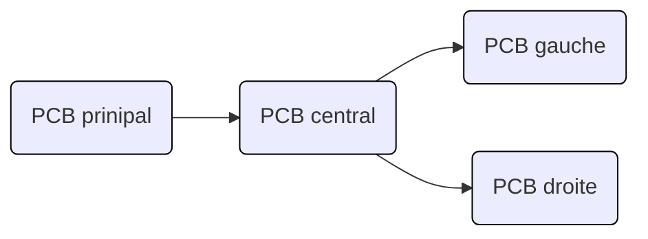

# Partie éléctronique TOF

## Sommaire

---

## Présentation
>Bienvenue dans la partie éléctronique du projet, dans ce dossier sont présent tous les fichiers de conception du PCB KiCad ainsi que tous les fichiers de fabrications Gerber.  
Deux projets sont actuellement dans le directory. Tom&Jerry_PCB pour le PCB principal et TOF_PCB pour le secondaire.   
Il est détaillé chaque composante du Schématique/PCb des TOF dans ce ReadMe. Sinon pour le principal aller [ici](READMETom&Jerry.md)

---

## Contexte 
>Pour pouvoir respecter la contrainte pour laquelle le robot ne doit pas tombé nous avons choisis deux solutions techniques la première est d'utiliser des capteurs moustaches positionné à l'avant et à l'arrière du robots. La deuxième solution est d'utiliser des TOF (Time of Flight). Pour pouvoir les fixer aux robots nous avons fais des pièces en 3D qui seront présenté dans le ReadMe consacré à la mécanique.

---
## Solution technique
>Nous avons choisi d'utiliser 6 TOF, 3 à l'avant du robot et 3 à l'arrièere. Nous avons donc fais 6 PCB pour pouvoir relier nos capteur TOF au PCB principale. Le PCB fixé au capteur TOF centrale est relié au PCB principal et ensuite celui-ci est relié au deux autres PCB.

>Les PCB fabriqué sont des PCB deux couches qui ont été fabriqué à l'ENSEA.

| PCB gauche | PCB central  | PCB droit |
| ------------- | ------------- |--------------|
| 
 
  | 
 
  |  
 
 |
| 
 
  | 
 
  | 
 
 |

## Auteurs : 
>* Jolan Thomasset (jolan.thomasset@ensea.fr)  
>* Romain Pace   (romain.pace@ensea.fr)  
>* Rémi Weidle   (remi.weidle@ensea.fr)  
