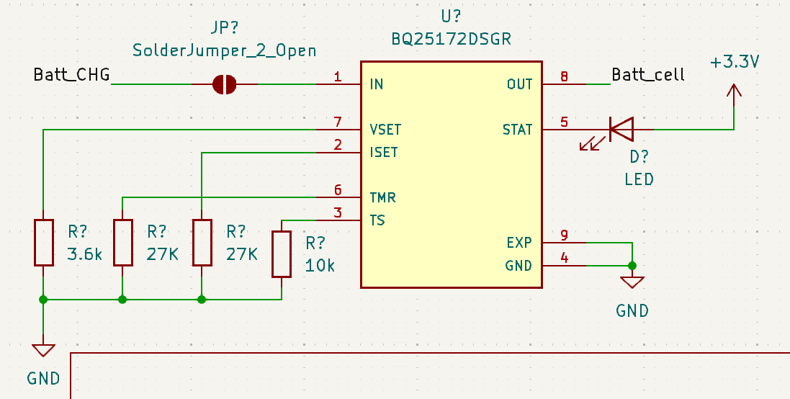

# Partie éléctronique  TOM&JERRY

## Sommaire
- [Présentation](#présentation)
- [Alimentation](#alimentation)
- [Driver Moteurs](#drivers-moteurs)
- [STM32](#stm32)
- [Peripheriques](#périphériques)
- [Peripherique Annexe](#périphériques-annexes)
- [Peripherique Annexe](#périphériques-annexes)
- [Musique](#musique)
- [Routage](#routage)
- [Erreurs](#erreurs-notables)

---

## Présentation
>Bienvenue dans la partie éléctronique du projet, dans ce dossier sont présent tous les fichiers de conception du PCB KiCad ainsi que tous les fichiers de fabrications Gerber.  
Deux fichiers sont actuellement dans le directory. Tom&Jerry_PCB pour le PCB principal et TOF_PCB pour le secondaire.   
Il est détaillé chaque composante du Schématique/PCb principal dans ce ReadMe. Sinon pour les TOF aller [ici](READMETOF.md)

---

## Alimentation
>[!Tip]
>Pour notre robot nous utilisons plusieurs système pour gérer le circuit d'alimentation. On a entre autre un BMS ( Batterie système management ), ainsi qu'un pseudo Power Path Management. La batterie utilisée est la suivante : [here](../datasheet/Batterie.pdf)  

>[!Tip]
>Des connecteurs Pac-Man sont utilisés au niveau de la recharge de batterie afin de pouvoir déconnecter facilement le circuit de charge si il est foireux. De plus un interrupteur est ajouté pour allumer/Eteindre le robot ainsi qu'un fusible pour protéger des surcourants sur la batterie.  

**Recharge de batterie**

[Recharge](../screenshot/electronique/usbC.png)

>Pour la recharge de la batterie nous prévoyons deux connecteurs : Type-C et Bornier afin de pouvoir recharger la batterie par alimentation stabilisée de labo ainsi que par cable USB-C (Plus difficile à mettre en oeuvre) [Documentation1](../datasheet/PPM_BMS.pdf).  

  

>[!Note]
>Cette entrée d'energie est gérée par le **BMS [BQ25172DSGR](../datasheet/BQ25172.pdf) de TI**. Celui-ci est cablé tel quel :  
>* IN : Entrée de tension de charge de batterie. Max 0.8 A (Cf : Doc)  
>* VSET : Programme le nombre de cellule --> 6 cellules + Charge intermittente  
>* ISET : Programme le courant de charge --> 0.8A   
>* TMR : Programme le Timer de sureté --> 6Hr  
>* TS : Programme la température de sureté de charge --> Donnée constructeur    
>* OUT : Sortie de tension de charge de la batterie  
>* STAT : Sortie d'indication de l'état de charge à drain ouvert  
>* EXP : Ground (Pad thermique)  
>* GND : Ground  

[CanalP](../screenshot/electronique/canalP.png)

>On a un transistor à canal P pour bloquer la charge du circuit par batterie lorsqu'une tension vient du bornier ou de l'USB-C. De plus on ajoute des condensateur (C...) pour eviter les retours de courant dû a des freinage des roues dans la résistance et donc dans l'alimentation derrière [(Doc)](../datasheet/slua376.pdf).    

>On utilise un premier convertisseur Buck pour abaisser la tension à 5V. Celui-ci est à découpage donc plus cher mais possède un meilleur rendement et un plus faible échauffement. Cela est parfait puisqu'il alimente le lidar ainsi que tous les circuits 3.3v derrière et donc peut avoir des appels de courant assez élevé (Comme démarrage de lidar).  

>[!Note]
>**Convertisseur Buck ([MP1475](../datasheet/MP1475.pdf))**  
>* IN : Tension d'entrée  
>* BST : Bootstrap  
>* SWT : Sortie de commutation  
>* PG : Sortie de puissance  
>* VCC : LDO interne de 5v  
>* EN/SYNC : Pour les clocks externes  
>* FB : Feedback  
>* GND : Ground  

>Actuellement les données sont celle ce la doc. La seule chose réglée est le pont diviseur avec une Vref = 1.25V pour avoir une sortie de 5V en sortie.  

>Simple convertisseur linéaire qui abaisse de 5V vers 3.3V pour alimenter certains capteurs ou encore la STM32 qui n'accepte pas du 5V. L'utilisation d'un buck serai plus utile si on recherche la performance cependant un LDO est suffisant car moins couteux, plus simple à mettre en place. L'abaissement de tension est faible sur de faible courants par conséquent la dissipation thermique sera faible ce qui justifie un LDO plutôt qu'un buck.  

>[!Note]
>**Convertisseur LDO [(BU33SD5WG-TR)](../datasheet/buxxsd5wg-e.pdf)**  
>* VIN : Tension d'entrée  
>* GND : Ground  
>* STBY : StandBy --> Ici sur High il marche dés qu'il est alimenté.   
>* N. C. : No Connected pin  
>* Vout : Tension de sortie  

---

## Drivers moteurs
>Afin de pouvoir mouvoir le robot sur la table de jeu, nous utilisons des moteurs type MCC (DfRobot FIT0520). Ces moteurs possèdent des codeurs déjà sur l'arbre moteur ce qui a l'avantage de ne négliger aucun décalage entre une roue de codeur et la roue de l'arbre moteur. Cependant si jamais la roue patine ou glisse le codeur ne prendra pas en compte ce dérapage ce qui entrainera des erreurs. Il faut donc impérativement que la mécanique permette au robot de rester particulièrement stabilisé sur le sol.  

>[!Note]
>Branché sur la carte les deux moteurs auront de beaux JST-XH de 6 Pins chacun tels que :  
>* Motor - : Phase - du moteur  
>* Motor + : Phase + du moteur  
>* GND : Ground   
>* 5V : Alimentation des codeurs en 5V   
>* Codeur PH1 : Pin allant avec PH2 avec la trame du codeur pour déterminer ensuite la vitesse du robot.   
>* Codeur PH2 : Pin allant avec PH1 avec la trame du codeur pour déterminer ensuite la vitesse du robot.   

>Pour controler ces deux moteurs chaque moteur aura son driver.   

>[!Note]
>**Driver [ZXBM5210](../datasheet/ZXBM5210.pdf)**  
>* Vref : Tension de référence pour setup l'oscillator PWM du composant.   
>* VDD : Alimentation du composant en 5V   
>* VM : Tension d'alimentation des moteurs  
>* FWD : PWM pour faire avancer le robot  
>* REV : PWM pour faire reculer le robot  
>* Out 1 :  Sortie au moteur phase -  
>* Out 2 : Sortie au moteur phase +  

>[!Important]
>Il est à noter que des capa de découplage sont utilisés afin d'éviter les fluctuation de courant trop rapide sur Vref ( Car tension de référence), sur les phases du moteur afin d'éviter des signaux créneau pur. De plus la documentation suggère un système de diode afin d'éviter la réversibilité du courant vers la batterie. Celui-ci ne sera pas utilisé afin d'éviter de cramer des diodes suite à des quantités trop importantes de courant que se déchargeraient dans les diodes.   

>[!Tip]
>En plus de cela nous utilisons un composant pour mesurer le courant drainé de la batterie vers les moteurs à l'aide d'une résistance dite shunt. Ce composant permettra de nous aider à asservir pourquoi pas en courant mais aussi de protection afin d'éviter comme nous n'avons pas mis les diodes d'avoir des données sur ce qui se passe.  

>[!Note]
>**Mesureur de courant [NCS199A2RSQT2G](../datasheet/NCS199A2RSQT2G.pdf)**  
>* GND : Ground  
>* In + : Entrée + coté résistance de shunt pour capter le courant  
>* In - : Entrée - coté résistance de shunt pour capter le courant  
>* Vs : Tension d'alimentation du composant  
>* Vref : Tension de référence dont je ne sais pas à quoi elle sert (J'ai cable comme la doc)  
>* Out : Sortie du composant avec ke courant prêt à être lu par un ADC  

>Comme toute entrée de composant celui-ci ne fait pas l'impasse une capacité de découplage a été ajoutée. De plus la résistance de 1kOhm a été mise pour préparer l'entrée du courant dans l'ADC conforme à la documentation.  

---

## STM32 
>[!Important]
>Avant de développer sur la STM32 et la facon dont nous avons répartis les pins de celle-ci. Pour que celle-ci fonctionne correctement nous utiliserons un quartz externe pour cadencer la STM32 (Configuré dans l'IOC de STM32CubeIDE). 

>[!Important]
>De plus nous utilisons une connexion STLink pour le debug de la carte via PC. 

---

## Périphériques 

>[!Note]
>La carte actuelle va gérer certains capteurs. Avec ceux-ci le robot pourra (Nous l'esperons) se repérer sur la table et réaliser au mieux la stratégie mise en place. 

>[!Tip]
> Afin de détecter les bords nous avons décider de faire de la redondance. En effet nous utilisons des capteurs "Moustache" ainsi que TOF pour repérer les bords de la table et éviter que les robots tombent. L'avantage des capteurs moustache est qu'ils sont mécanique donc fiable maintenant cela demande de na pas louper son intégration sur la base roulante ce qui n'es tpas gagner. Pour cela nous pouvvons utiliser les TOF. Ceux-ci sont plus simple à positionner sur le robot et à fonctionner. Cependant l'exploitation des données est plus dure (I2C + GPIO Extender...). 

>[!Note]
>Branché sur la carte les quatre capteurs moustahce ont un JST  :  
>* 3.3V : Alimentation
>* GND : Ground  
>Ceux-ci marchent en interrupteur pas besoin de plus de chose pour lire leurs données. 

>[!Note]
>**Capteurs TOF [VL53L1X](../datasheet/VL53L1X.pdf):**   
>* AVDDVCSEL : VCSEL tension d'alimentation  
>* AVSSVCSEL : VCSEL Ground    
>* GND1 - GND4 : Ground  
>* XShut: Pin pour shutdown le composant. celui-ci est actif sur un signal Bas  
>* GPIO1 : GPIO pour gérer les interruptions  
>* DNC : A ne pas connecter (Doit être floating)  
>* SDA : Serial data bus
>* SCL : Serial clock bus
>* AVDD : Tension d'alim du composant
>Ceux-ci sont sur les cartes fournient avec produit par STM32. 

>[!Note]
>En plus de la détection de bord avec les TOF et les capteurs "Moustache", le robot aura un IMU pour faire de la fusion de donnée (Rédigé en septembre ca ne sera pas traité pas assez de temps) ainsi que de vérifier si un robot nous touche. De plus il y aura un lidar pour détecter les robots sur la table et foncer sur eux. 

>[!Note]
>**Capteurs TOF [YDLidar X2](../datasheet/YdLidarX4.pdf):**   
>* NC : Non connected pin   
>* TX : Sortie UART avec les données du LIDAR   
>* RX : Entrée UART avec les données du LIDAR   
>* GND : Ground    
>* M_EN Motor enable control   
>* DEV_EN Ranging enable control  
>* M_CTR : Entrée de la PWM du moteur du Lidar      
>* VCC Power supply  
     
  
>* VCC : Tension d'alimentation du lidar (5v)  

 

>[!Note]
>**IMU [ADXL343](../datasheet/ADXL343.pdf):**   
>* Vs : Tension d'alimentation du composant   
>* GND : Ground   
>* VDD : Tension d'alimentation de l'interface digitale  
>* SDA : Serial data bus  
>* SCL : Serial clock bus  
>* SDO : I2C adresse  
>* NC : A garder non connecte  
>* Int1 - Int2 : Pin d'interruption   
>* CS : Chip Select

---

## Périphériques Annexes 
>Deux composants non imposés ont été utilisés en plus de ceux imposés afin de pouvoir tout connecter à la STM32. Suite à la solution technique des TOF employé le nombre de GPIO recquis a quelque peu explosé surpassant la capacité de la STM. par conséquent un GPIO Extender est utilisé pour ajouter des GPIO afin de couper et utiliser les TOF lorsque nous en avons besoin.   

>[!Note]
>**GPIO Extender [TCA9555RTWR](../datasheet/TCA9555.pdf)**  
>* A0 : Adress Input 0  
>* A1 : Adress Input 1  
>* A2 : Adress Input 2  
>* GND : Ground   
>* P00 à P17 : P/port I/O connecte comme Input au démarrage.   
>* SCL : Serial clock bus  
>* SDA : Serial data bus  
>* VCC : Tension d'alimentation du composant  
>* INT : Permet de donner des interruptions avec une Pull-Up resistance.   

>[!Tip]
>En plus de ce composant nous avons utilisé un petit composant pour traiter nos leds. En effet en comptant 4 de débugs, robot allumé, chat/souris,... Nous nous sommes sentis à l'étroit et avons décidé de rajouter un composant qui drive 4 RGB. Cela sera parfait pour débug et montrer les informations nécessaires.  

>[!Note]
>**RGB LED Driver [LP5812CDSDR](../datasheet/LP5812.pdf)**  
>* VCC : Tension d'alimentation du composant  
>* GND : Ground  
>* SYNC : Synchro du composant sur GND (C'est la doc je sais pas pk)  
>* SCL : Serial clock bus  
>* SDA : Serial data bus   
>* OUT0 - OUT3 : Sorties vers les LED   

>Pour ce composant nous verrons pour le faire marcher en temps voulu avec le SPI pour allumer nos LEDS. Celles-ci sont cablés comme décrit dans la documentation.   

---

## Musique 
>Ayant dans notre groupe notre jolan nationnal, le projet ne pouvait être correctement réalisé sans l'ajout de bout de musique sur le robot. Pour se faire les sorties DAC de la STM32 dédiées seront utilisées. Ce signal audio sera amplifié par un amplificateur de Classe D puis va être envoyé dans des hauts parleurs.   

>[!Note]
>**Ampli de Classe D [PAM8302AAY](../datasheet/PAM8302A.pdf)**  
>* IN + : Entrée DAC  +  
>* IN - : Entrée DAC  -   
>* SD : Doit rester sur HIGh pour éviter qu'il soit shutdown (donc relié à 3.3v)  
>* VDD : Alimentation du composant  
>* OUT + : Sortie + du haut parleur   
>* OUT - : Sortie - du haut parleur  

>[!Important]
>Les deux capacité de découplage ainsi que les deux ferrites sont celles conforme à la documentation afin de réduire les interférence electromagnétique à partir de 1MHz et au dela. Ceci est parfait puisque ce composant est à coté de composant sensible comme la STM...  

## Routage 

> Le PCB a été particulièrement difficile à router. Beaucoup de composants devaient être placées en peu d'espace. Certaines contraintes physique ont cependant dû être vérifiée afin que le montage se passe au mieux. Les condensateurs de découplage de la SMT32 ont été placé au plus proche de celle-ci afin d'éviter les reboot intempestif. De plus le crystal a été placé au plus proche aussi. Enfin les connecteurs sortent des dimensions avec un silkscreen entièrement remanié à cause de la superposition du nom des composants. 

## Erreurs notables 

>[!Important] 
>* Il faut vérifier absolument ces points qui ont été mal réalisé auparavant.   
>* L'empreinte de la bobine pour l'entrée ADC doit avoir la bonne empreinte. Le cas échéant ceci peut amener à des soucis notables.   
>* Une erreur a été commise sur l'attribution des timer en effet les encodeur prennent un advance timer chacun pour obtenir la vitesse du robot. Or nous en avons mis deux sur le même timer. Pour la suite du projet nous n'avons pas pu réaliser la partie encoder. Il suffirait de déplacer un encoder sur un autre timer  compatible avec le mode encoder.   

## Auteurs : 
>* Jolan Thomasset (jolan.thomasset@ensea.fr)  
>* Romain Pace   (romain.pace@ensea.fr)  
>* Rémi Weidle   (remi.weidle@ensea.fr)  