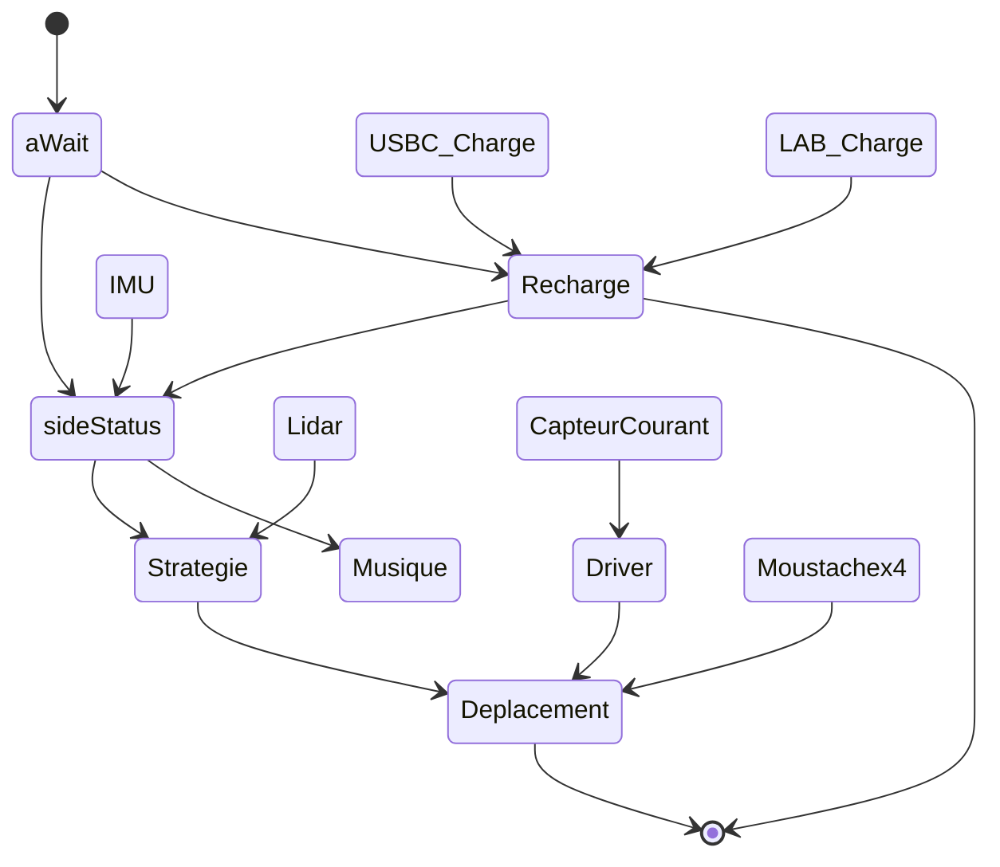

# Partie SOFTWARE 

## Sommaire
- [Présentation](#présentation)
- [Architecture](#architecture)
- [Driver-Lidar](#driver-lidar)

---

## Présentation
>Bienvenue dans la partie développement du projet, dans ce dossier sont présent tous les fichiers de programmation de la STM32. Ceci comprend la configuration de la puce ainsi que les files de projet classique.  

---

## Architecture



---

## Driver du Lidar X4

---

### Fonctionnalités principales
- **Démarrage/arrêt** du scan du LiDAR
- **Obtention des informations** sur le capteur (modèle, version firmware, numéro de série)
- **Diagnostic de santé** pour vérifier l'état du capteur
- **Traitement des trames** pour extraire les distances et angles
- **Filtrage et clustering** des données pour détecter des obstacles

---

### Structures de données

#### `LIDAR_device_info_t`
Structure contenant les informations de l'appareil.
```c
typedef struct {
    uint16_t start_sign;
    uint32_t length;
    uint8_t mode;
    uint8_t type_code;
    uint8_t model;
    char firmware[6];
    uint8_t hardware;
    char serial[17];
} LIDAR_device_info_t;
```

#### `LIDAR_health_stat_t`
Structure contenant l'état de santé du LiDAR.
```c
typedef struct {
    uint16_t start_sign;
    uint32_t length;
    uint8_t mode;
    uint8_t type_code;
    uint8_t status_code;
    uint16_t error_code;
} LIDAR_health_stat_t;
```

#### `LIDAR_processing_t`
Structure pour le traitement des données reçues.
```c
typedef struct LIDAR_processing_struct {
    uint8_t frame_buff[FRAME_BUFF_SIZE];
    int point_buff[POINT_BUFF_SIZE];
    uint8_t receive_buff[DATA_BUFF_SIZE];
    int filtred_buff[NB_DEGRES];
    Cluster_t clusters[MAX_CLUSTERS];
    int cluster_cnt;
} LIDAR_processing_t;
```

#### `h_LIDAR_t`
Structure principale du LiDAR.
```c
typedef struct {
    LIDAR_serial_drv_t serial_drv;
    LIDAR_device_info_t device_info;
    LIDAR_health_stat_t health_stat;
    LIDAR_processing_t processing;
    volatile uint8_t rx_flag_uart;
    volatile uint8_t rx_flag_dma;
} h_LIDAR_t;
```

---

### Prototypes des fonctions

#### Fonctions de contrôle
```c
int LIDAR_stop(h_LIDAR_t * h_LIDAR);
int LIDAR_restart(h_LIDAR_t * h_LIDAR);
int LIDAR_get_info(h_LIDAR_t *h_LIDAR);
int LIDAR_get_health_stat(h_LIDAR_t *h_LIDAR);
```

#### Fonctions de traitement des données
```c
int LIDAR_start_scan_dma(h_LIDAR_t *h_LIDAR);
void LIDAR_process_frame(h_LIDAR_t *h_LIDAR, uint8_t *buff);
void medianFilter(h_LIDAR_t *LIDAR);
void find_clusters(h_LIDAR_t *LIDAR);
void kMeansClustering(h_LIDAR_t *LIDAR);
```

---

### Description des fonctions

#### `LIDAR_stop`
Arrête le scan du LiDAR.
- **Entrées** :
  - `h_LIDAR_t *h_LIDAR` : Pointeur vers la structure LiDAR
- **Sorties** :
  - `0` en cas de succès, `-1` en cas d'erreur de transmission, `-2` en cas de timeout

#### `LIDAR_restart`
Redémarre le LiDAR.
- **Entrées** :
  - `h_LIDAR_t *h_LIDAR` : Pointeur vers la structure LiDAR
- **Sorties** :
  - `0` en cas de succès, `-1` en cas d'erreur de transmission

#### `LIDAR_get_info`
Récupère les informations du LiDAR.
- **Entrées** :
  - `h_LIDAR_t *h_LIDAR` : Pointeur vers la structure LiDAR
- **Sorties** :
  - `0` en cas de succès, code d'erreur négatif sinon

#### `LIDAR_get_health_stat`
Récupère l'état de santé du LiDAR.
- **Entrées** :
  - `h_LIDAR_t *h_LIDAR` : Pointeur vers la structure LiDAR
- **Sorties** :
  - `0` en cas de succès, code d'erreur négatif sinon

#### `LIDAR_start_scan_dma`
Démarre le scan en mode DMA.
- **Entrées** :
  - `h_LIDAR_t *h_LIDAR` : Pointeur vers la structure LiDAR
- **Sorties** :
  - `0` en cas de succès, code d'erreur négatif sinon

#### `LIDAR_process_frame`
Traite les trames reçues et extrait les distances et angles.
- **Entrées** :
  - `h_LIDAR_t *h_LIDAR` : Pointeur vers la structure LiDAR
  - `uint8_t *buff` : Buffer contenant les données à traiter

---

### Entrées/Sorties

| Fonction                 | Entrées                      | Sorties                       |
|--------------------------|-------------------------------|-------------------------------|
| `LIDAR_stop`             | `h_LIDAR_t *`                 | `int`                         |
| `LIDAR_restart`          | `h_LIDAR_t *`                 | `int`                         |
| `LIDAR_get_info`         | `h_LIDAR_t *`                 | `int`                         |
| `LIDAR_get_health_stat`  | `h_LIDAR_t *`                 | `int`                         |
| `LIDAR_start_scan_dma`   | `h_LIDAR_t *`                 | `int`                         |
| `LIDAR_process_frame`    | `h_LIDAR_t *`, `uint8_t *`    | `void`                        |
| `medianFilter`           | `h_LIDAR_t *`                 | `void`                        |
| `find_clusters`          | `h_LIDAR_t *`                 | `void`                        |
| `kMeansClustering`       | `h_LIDAR_t *`                 | `void`                        |

---

## Auteurs : 
>* Jolan Thomasset (jolan.thomasset@ensea.fr)  
>* Romain Pace   (romain.pace@ensea.fr)  
>* Rémi Weidle   (remi.weidle@ensea.fr)  