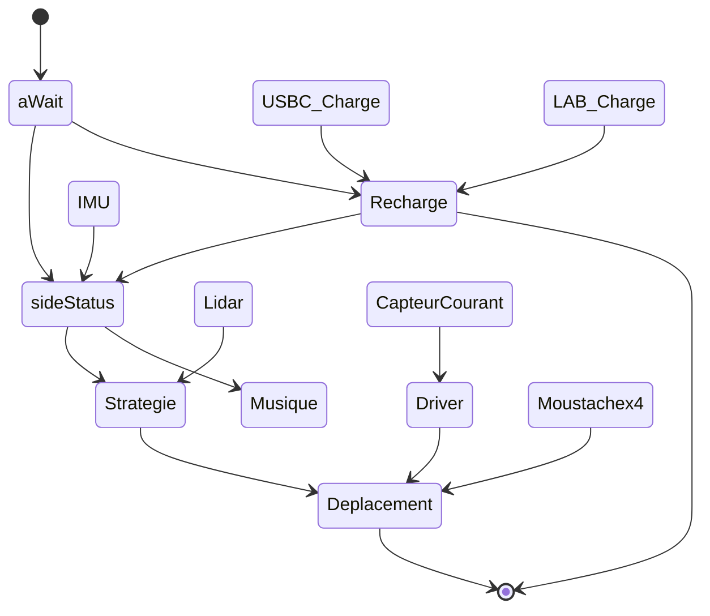

# Partie SOFTWARE 

## Sommaire
- [Présentation](#présentation)
- [Architecture](#architecture)

---

## Présentation
>Bienvenue dans la partie développement du projet, dans ce dossier sont présent tous les fichiers de programmation de la STM32. Ceci comprend la configuration de la puce ainsi que les files de projet classique.  

---

## Architecture

