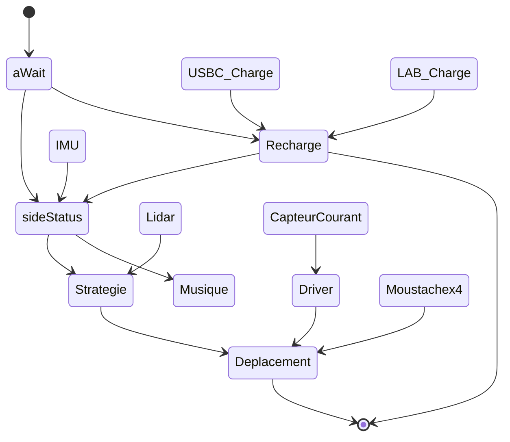

# Partie SOFTWARE 

## Sommaire
- [Présentation](#présentation)
- [Architecture](#architecture)
- [Driver-Lidar](#driver-lidar)
- [Driver moteur](#driver-du-zxb5210-driver-moteur)
- [Driver GPIO-Expander](#driver-du-tca9555-gpio-expander)
- [Driver LED](#driver-du-lp5812-driver-led)
- [Driver IMU](#driver-de-ladxl343-imu)

---

## Présentation
>Bienvenue dans la partie développement du projet, dans ce dossier sont présent tous les fichiers de programmation de la STM32. Ceci comprend la configuration de la puce ainsi que les files de projet classique.  

---

## Architecture



## Liste des Tâches du robot

1. **Tâche changeMode_run**
   - **Rôle** : Gère le changement de mode du système.
   - **Priorité** : 1

2. **Tâche lidarTake**
   - **Rôle** : Collecte les données brutes du capteur LiDAR.
   - **Priorité** : 5

3. **Tâche lidarprocess**
   - **Rôle** : Traite les données du LiDAR.
   - **Priorité** : 5

4. **Tâche shell_run**
   - **Rôle** : Fournit une interface en ligne de commande.
   - **Priorité** : 4

5. **Tâche asserv_courant_run** (non active)
   - **Rôle** : Gère l'asservissement en courant des moteurs.
   - **Priorité** : 2

6. **Tâche asserv_position_run** (non active)
   - **Rôle** : Gère l'asservissement en position des moteurs.
   - **Priorité** : 3

---

---

## Driver du Lidar X4

---

### Fonctionnalités principales
- **Démarrage/arrêt** du scan du LiDAR
- **Obtention des informations** sur le capteur (modèle, version firmware, numéro de série)
- **Diagnostic de santé** pour vérifier l'état du capteur
- **Traitement des trames** pour extraire les distances et angles
- **Filtrage et clustering** des données pour détecter des obstacles

---

### Structures de données

#### `LIDAR_device_info_t`
Structure contenant les informations de l'appareil.
```c
typedef struct {
    uint16_t start_sign;
    uint32_t length;
    uint8_t mode;
    uint8_t type_code;
    uint8_t model;
    char firmware[6];
    uint8_t hardware;
    char serial[17];
} LIDAR_device_info_t;
```

#### `LIDAR_health_stat_t`
Structure contenant l'état de santé du LiDAR.
```c
typedef struct {
    uint16_t start_sign;
    uint32_t length;
    uint8_t mode;
    uint8_t type_code;
    uint8_t status_code;
    uint16_t error_code;
} LIDAR_health_stat_t;
```

#### `LIDAR_processing_t`
Structure pour le traitement des données reçues.
```c
typedef struct LIDAR_processing_struct {
    uint8_t frame_buff[FRAME_BUFF_SIZE];
    int point_buff[POINT_BUFF_SIZE];
    uint8_t receive_buff[DATA_BUFF_SIZE];
    int filtred_buff[NB_DEGRES];
    Cluster_t clusters[MAX_CLUSTERS];
    int cluster_cnt;
} LIDAR_processing_t;
```

#### `h_LIDAR_t`
Structure principale du LiDAR.
```c
typedef struct {
    LIDAR_serial_drv_t serial_drv;
    LIDAR_device_info_t device_info;
    LIDAR_health_stat_t health_stat;
    LIDAR_processing_t processing;
    volatile uint8_t rx_flag_uart;
    volatile uint8_t rx_flag_dma;
} h_LIDAR_t;
```

---

### Prototypes des fonctions

#### Fonctions de contrôle
```c
int LIDAR_stop(h_LIDAR_t * h_LIDAR);
int LIDAR_restart(h_LIDAR_t * h_LIDAR);
int LIDAR_get_info(h_LIDAR_t *h_LIDAR);
int LIDAR_get_health_stat(h_LIDAR_t *h_LIDAR);
```

#### Fonctions de traitement des données
```c
int LIDAR_start_scan_dma(h_LIDAR_t *h_LIDAR);
void LIDAR_process_frame(h_LIDAR_t *h_LIDAR, uint8_t *buff);
void medianFilter(h_LIDAR_t *LIDAR);
void find_clusters(h_LIDAR_t *LIDAR);
void kMeansClustering(h_LIDAR_t *LIDAR);
```

---

### Description des fonctions

#### `LIDAR_stop`
Arrête le scan du LiDAR.
- **Entrées** :
  - `h_LIDAR_t *h_LIDAR` : Pointeur vers la structure LiDAR
- **Sorties** :
  - `0` en cas de succès, `-1` en cas d'erreur de transmission, `-2` en cas de timeout

#### `LIDAR_restart`
Redémarre le LiDAR.
- **Entrées** :
  - `h_LIDAR_t *h_LIDAR` : Pointeur vers la structure LiDAR
- **Sorties** :
  - `0` en cas de succès, `-1` en cas d'erreur de transmission

#### `LIDAR_get_info`
Récupère les informations du LiDAR.
- **Entrées** :
  - `h_LIDAR_t *h_LIDAR` : Pointeur vers la structure LiDAR
- **Sorties** :
  - `0` en cas de succès, code d'erreur négatif sinon

#### `LIDAR_get_health_stat`
Récupère l'état de santé du LiDAR.
- **Entrées** :
  - `h_LIDAR_t *h_LIDAR` : Pointeur vers la structure LiDAR
- **Sorties** :
  - `0` en cas de succès, code d'erreur négatif sinon

#### `LIDAR_start_scan_dma`
Démarre le scan en mode DMA.
- **Entrées** :
  - `h_LIDAR_t *h_LIDAR` : Pointeur vers la structure LiDAR
- **Sorties** :
  - `0` en cas de succès, code d'erreur négatif sinon

#### `LIDAR_process_frame`
Traite les trames reçues et extrait les distances et angles.
- **Entrées** :
  - `h_LIDAR_t *h_LIDAR` : Pointeur vers la structure LiDAR
  - `uint8_t *buff` : Buffer contenant les données à traiter

---

### Entrées/Sorties

| Fonction                 | Entrées                      | Sorties                       |
|--------------------------|-------------------------------|-------------------------------|
| `LIDAR_stop`             | `h_LIDAR_t *`                 | `int`                         |
| `LIDAR_restart`          | `h_LIDAR_t *`                 | `int`                         |
| `LIDAR_get_info`         | `h_LIDAR_t *`                 | `int`                         |
| `LIDAR_get_health_stat`  | `h_LIDAR_t *`                 | `int`                         |
| `LIDAR_start_scan_dma`   | `h_LIDAR_t *`                 | `int`                         |
| `LIDAR_process_frame`    | `h_LIDAR_t *`, `uint8_t *`    | `void`                        |
| `medianFilter`           | `h_LIDAR_t *`                 | `void`                        |
| `find_clusters`          | `h_LIDAR_t *`                 | `void`                        |
| `kMeansClustering`       | `h_LIDAR_t *`                 | `void`                        |

---

## Driver du ZXB5210 (Driver Moteur)

---

### Fonctionnalités principales
- **Initialisation** du driver ZXB5210
- **Démarrage/arrêt** du PWM pour la commande des moteurs
- **Contrôle de la vitesse** en avant et en arrière
- **Gestion des angles** pour diriger les moteurs
- **Mise à jour des impulsions** via interruption

---

### Structures de données

#### `MDriver_Config_t`
Structure de configuration pour les moteurs.
```c
typedef struct {
    uint32_t Tim_Channel;        // Canal du timer utilisé
    volatile uint32_t* CCR_Channel; // Pointeur vers le registre CCR
    uint32_t pulseGoal;          // Objectif d'impulsion
    uint32_t offset;             // Offset utilisé pour le calcul de vitesse
} MDriver_Config_t;
```

#### `MDriver_t`
Structure principale du driver moteur.
```c
typedef struct {
    TIM_HandleTypeDef* htim;    // Handle du timer
    MDriver_Config_t* FWD;      // Configuration pour la direction avant
    MDriver_Config_t* REV;      // Configuration pour la direction arrière
    MDriver_Config_t* ACTIVE;   // Direction active actuelle
} MDriver_t;
```

---

### Prototypes des fonctions

#### Fonctions de contrôle
```c
void ZXB5210_init(void);
void ZXB5210_deinit(void);
```

#### Fonctions de gestion de la vitesse
```c
void ZXB5210_speed_FWD(MDriver_t* MDriver, uint8_t alpha);
void ZXB5210_speed_REV(MDriver_t* MDriver, uint8_t alpha);
```

#### Fonctions avancées
```c
void IT_ZXB5210_speed_UPDATE(MDriver_t* MDriver, MDriver_Config_t* SENS);
void ZXB5210_calc_speed(MDriver_Config_t* MDriver_Config, uint32_t initial_Pulse);
void ZXB5210_angle(int angle);
```

---

### Description des fonctions

#### `ZXB5210_init`
Initialise le driver ZXB5210 en configurant les timers et canaux PWM.
- **Entrées** : Aucune
- **Sorties** : Aucune

#### `ZXB5210_deinit`
Arrête le driver ZXB5210 en stoppant les canaux PWM.
- **Entrées** : Aucune
- **Sorties** : Aucune

#### `ZXB5210_speed_FWD`
Configure la vitesse du moteur en mode avant.
- **Entrées** :
  - `MDriver_t* MDriver` : Pointeur vers la structure du driver moteur
  - `uint8_t alpha` : Pourcentage de la vitesse souhaitée (0 à 100)
- **Sorties** : Aucune

#### `ZXB5210_speed_REV`
Configure la vitesse du moteur en mode arrière.
- **Entrées** :
  - `MDriver_t* MDriver` : Pointeur vers la structure du driver moteur
  - `uint8_t alpha` : Pourcentage de la vitesse souhaitée (0 à 100)
- **Sorties** : Aucune

#### `IT_ZXB5210_speed_UPDATE`
Met à jour les impulsions de vitesse via interruption.
- **Entrées** :
  - `MDriver_t* MDriver` : Pointeur vers la structure du driver moteur
  - `MDriver_Config_t* SENS` : Pointeur vers la configuration de la direction active
- **Sorties** : Aucune

#### `ZXB5210_calc_speed`
Calcule et ajuste la vitesse en fonction des impulsions.
- **Entrées** :
  - `MDriver_Config_t* MDriver_Config` : Pointeur vers la configuration du moteur
  - `uint32_t initial_Pulse` : Nombre initial d'impulsions
- **Sorties** : Aucune

#### `ZXB5210_angle`
Permet de contrôler les deux moteurs pour orienter le robot selon un angle donné.
- **Entrées** :
  - `int angle` : Angle souhaité (0 à 360 degrés)
- **Sorties** : Aucune

---

### Entrées/Sorties

| Fonction                   | Entrées                                 | Sorties |
|----------------------------|-----------------------------------------|---------|
| `ZXB5210_init`             | Aucune                                  | Aucune  |
| `ZXB5210_deinit`           | Aucune                                  | Aucune  |
| `ZXB5210_speed_FWD`        | `MDriver_t*`, `uint8_t`                 | Aucune  |
| `ZXB5210_speed_REV`        | `MDriver_t*`, `uint8_t`                 | Aucune  |
| `IT_ZXB5210_speed_UPDATE`  | `MDriver_t*`, `MDriver_Config_t*`       | Aucune  |
| `ZXB5210_calc_speed`       | `MDriver_Config_t*`, `uint32_t`         | Aucune  |
| `ZXB5210_angle`            | `int`                                   | Aucune  |

---

## Driver du TCA9555 (GPIO Expander)

---

### Fonctionnalités principales
- **Initialisation** du GPIO expander TCA9555
- **Lecture et écriture** des registres du TCA9555 via I2C
- **Configuration des ports** en entrée ou sortie
- **Gestion des inversions de polarité** sur les ports

---

### Structures de données

#### `GPIOExpanderRegister_t`
Structure représentant un registre du GPIO expander.
```c
typedef struct {
    char* name;   // Nom du registre
    uint8_t reg;  // Adresse du registre
} GPIOExpanderRegister_t;
```

---

### Prototypes des fonctions

#### Fonctions principales
```c
void TCA9555_init(void);
HAL_StatusTypeDef TCA9555_WriteRegister(uint8_t reg, uint8_t data);
HAL_StatusTypeDef TCA9555_ReadRegister(uint8_t reg, uint8_t* recptData, uint8_t lenData);
```

---

### Description des fonctions

#### `TCA9555_init`
Initialise le GPIO expander TCA9555 en configurant les registres de configuration et de polarité.
- **Entrées** : Aucune
- **Sorties** : Aucune
- **Détails** :
  - Configure les ports 0 et 1 en entrée ou sortie.
  - Lit et affiche la valeur initiale des registres de l’expander.

#### `TCA9555_WriteRegister`
Écrit une valeur dans un registre du GPIO expander.
- **Entrées** :
  - `uint8_t reg` : Adresse du registre à écrire
  - `uint8_t data` : Donnée à écrire dans le registre
- **Sorties** :
  - `HAL_StatusTypeDef` : Statut de la transmission I2C

#### `TCA9555_ReadRegister`
Lit une valeur à partir d’un registre du GPIO expander.
- **Entrées** :
  - `uint8_t reg` : Adresse du registre à lire
  - `uint8_t* recptData` : Pointeur pour recevoir les données lues
  - `uint8_t lenData` : Nombre d’octets à lire
- **Sorties** :
  - `HAL_StatusTypeDef` : Statut de la transmission I2C

---

### Entrées/Sorties

| Fonction                   | Entrées                                 | Sorties                     |
|----------------------------|-----------------------------------------|-----------------------------|
| `TCA9555_init`             | Aucune                                  | Aucune                      |
| `TCA9555_WriteRegister`    | `uint8_t`, `uint8_t`                    | `HAL_StatusTypeDef`         |
| `TCA9555_ReadRegister`     | `uint8_t`, `uint8_t*`, `uint8_t`        | `HAL_StatusTypeDef`         |

---

## Driver du LP5812 (Driver LED)

---

### Fonctionnalités principales
- **Initialisation** du pilote de LED LP5812
- **Lecture et écriture** des registres 16 bits du LP5812 via I2C
- **Configuration des LEDs** en mode direct drive
- **Contrôle de l'intensité lumineuse** des LEDs

---

### Prototypes des fonctions

#### Fonctions principales
```c
void LP5812_Init(void);
HAL_StatusTypeDef LP5812_WriteRegister(uint16_t reg_addr, uint8_t data);
HAL_StatusTypeDef LP5812_ReadRegister(uint16_t reg_addr, uint8_t *pData);
```

---

### Description des fonctions

#### `LP5812_Init`
Initialise le pilote de LED LP5812 en configurant les différents registres pour activer les LEDs et régler l'intensité.
- **Entrées** : Aucune
- **Sorties** : Aucune
- **Détails** :
  - Active le composant en mettant le bit `chip_en` à 1.
  - Configure le mode de commande des LEDs en mode direct drive.
  - Initialise les registres pour contrôler les 12 LEDs avec une intensité prédéfinie.
  - Envoie une commande de mise à jour pour valider la configuration.

#### `LP5812_WriteRegister`
Écrit une valeur dans un registre 16 bits du LP5812.
- **Entrées** :
  - `uint16_t reg_addr` : Adresse 16 bits du registre à écrire
  - `uint8_t data` : Donnée à écrire dans le registre
- **Sorties** :
  - `HAL_StatusTypeDef` : Statut de la transmission I2C

#### `LP5812_ReadRegister`
Lit une valeur à partir d’un registre 16 bits du LP5812.
- **Entrées** :
  - `uint16_t reg_addr` : Adresse 16 bits du registre à lire
  - `uint8_t *pData` : Pointeur pour recevoir la donnée lue
- **Sorties** :
  - `HAL_StatusTypeDef` : Statut de la transmission I2C

---

### Entrées/Sorties

| Fonction                   | Entrées                                   | Sorties                     |
|----------------------------|-------------------------------------------|-----------------------------|
| `LP5812_Init`              | Aucune                                    | Aucune                      |
| `LP5812_WriteRegister`     | `uint16_t`, `uint8_t`                     | `HAL_StatusTypeDef`         |
| `LP5812_ReadRegister`      | `uint16_t`, `uint8_t*`                    | `HAL_StatusTypeDef`         |

---

## Driver de l'ADXL343 (IMU)

---

### Fonctionnalités principales
- **Initialisation** de l'accéléromètre ADXL343
- **Lecture et écriture** des registres via I2C
- **Acquisition des données d'accélération** sur les axes X, Y et Z
- **Calibration** automatique pour compenser les offsets

---

### Structures de données

#### `XYZ_t`
Structure contenant les valeurs d'accélération sur les trois axes.
```c
typedef struct {
    float X; // Accélération sur l'axe X en mm/s²
    float Y; // Accélération sur l'axe Y en mm/s²
    float Z; // Accélération sur l'axe Z en mm/s²
} XYZ_t;
```

#### `IMURegister_t`
Structure représentant un registre de l'IMU.
```c
typedef struct {
    char *name;   // Nom du registre
    uint8_t reg;  // Adresse du registre
} IMURegister_t;
```

---

### Prototypes des fonctions

#### Fonctions principales
```c
void ADXL343_init(void);
HAL_StatusTypeDef ADXL343_WriteRegister(uint8_t reg, uint8_t data);
HAL_StatusTypeDef ADXL343_ReadRegister(uint8_t reg, uint8_t* pData, uint8_t lenData);
XYZ_t ADXL343_getAcc(void);
```

---

### Description des fonctions

#### `ADXL343_init`
Initialise l'accéléromètre ADXL343 en configurant les différents registres.
- **Entrées** : Aucune
- **Sorties** : Aucune
- **Détails** :
  - Configure les registres de seuil, durée, latence et axes pour les détections de tap.
  - Active les interruptions pour les détections de tap et d'activité/inactivité.
  - Initialise le mode de puissance et le format des données.
  - Effectue une calibration automatique sur les trois axes.

#### `ADXL343_WriteRegister`
Écrit une valeur dans un registre du ADXL343.
- **Entrées** :
  - `uint8_t reg` : Adresse du registre à écrire
  - `uint8_t data` : Donnée à écrire dans le registre
- **Sorties** :
  - `HAL_StatusTypeDef` : Statut de la transmission I2C

#### `ADXL343_ReadRegister`
Lit une valeur à partir d’un registre du ADXL343.
- **Entrées** :
  - `uint8_t reg` : Adresse du registre à lire
  - `uint8_t* pData` : Pointeur pour recevoir les données lues
  - `uint8_t lenData` : Nombre d’octets à lire
- **Sorties** :
  - `HAL_StatusTypeDef` : Statut de la transmission I2C

#### `ADXL343_getAcc`
Récupère les données d'accélération sur les trois axes.
- **Entrées** : Aucune
- **Sorties** :
  - `XYZ_t` : Structure contenant les valeurs d'accélération sur les axes X, Y et Z en mm/s²
- **Détails** :
  - Lit les registres de données X, Y et Z.
  - Applique un filtrage simple pour ignorer les petites variations.

---

### Entrées/Sorties

| Fonction                   | Entrées                                   | Sorties                     |
|----------------------------|-------------------------------------------|-----------------------------|
| `ADXL343_init`             | Aucune                                    | Aucune                      |
| `ADXL343_WriteRegister`    | `uint8_t`, `uint8_t`                      | `HAL_StatusTypeDef`         |
| `ADXL343_ReadRegister`     | `uint8_t`, `uint8_t*`, `uint8_t`          | `HAL_StatusTypeDef`         |
| `ADXL343_getAcc`           | Aucune                                    | `XYZ_t`                     |

---
## Shell
>  Afin de pouvoir effectuer des tests unitaire le plus facilement possible nous avons décider d'utiliser un shell. Nous avons donc créer des fonctions pour tester les moteurs, pour vérifier le foncionement correct de l'ADXL ainsi que tester le LIDAR.
### Help
> Cette fonction permet d'ébumérer toutes les fonction présente dans le shell.
### Clear 
> Permet de supprimé toutes les actions effectué précédement sur l'écran.
### Start
> Permet de faire démarrer le robot.
### Stop
> Permet d'arrêter le robot.
### Speed 
> Permet de faire varier la vitesse des moteurs en controlant indépendament chaque moteur.
### Angle
> Permet de dire au robot à quel angle on détecte un peu et ansi vérifier si celui-ci s'orinte bien en face de l'objet détecté.
### CS
>
### LED
### imu
### imusf
### imuu
### imug
### adc
### Lidar
### miaou
### reset
___

## Auteurs : 
>* Jolan Thomasset (jolan.thomasset@ensea.fr)  
>* Romain Pace   (romain.pace@ensea.fr)  
>* Rémi Weidle   (remi.weidle@ensea.fr)  
